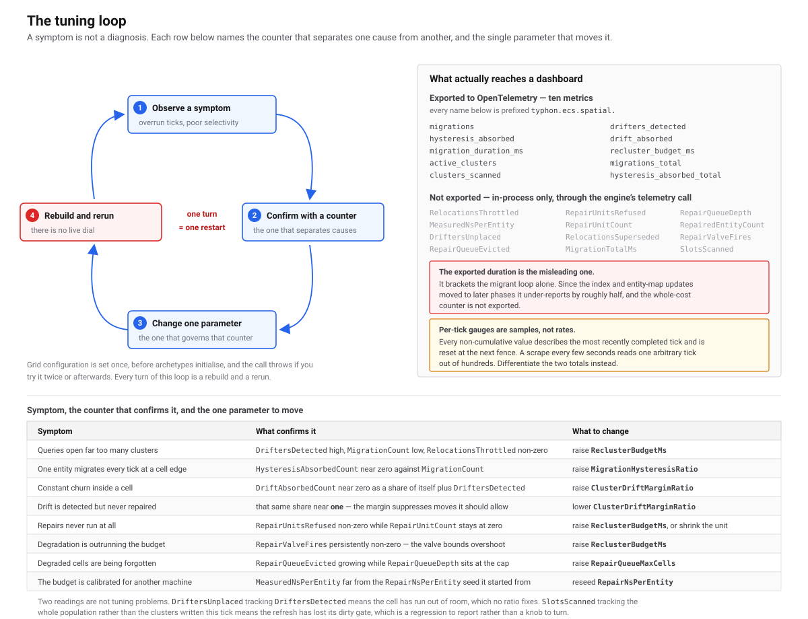

# Reading Spatial Telemetry
> Seventy-three counters that say which spatial parameter is wrong, and where each of them can be seen.

**Status:** ✅ Implemented · **Visibility:** Public · **Level:** 🟣 Advanced · **Category:** [Spatial](./README.md)

## 🎯 What it solves

The spatial partition is not self-configuring, and its failure mode is quiet. A cell size that is slightly wrong does
not throw; it spends the re-clustering budget every tick and hands your queries looser cluster boxes than it started
with. [Tuning the Spatial Grid](./spatial-tuning.md) lists the parameters. This page is the other half: the
counters that tell you *which* of them to change, so tuning is a measurement rather than a guess.

`SpatialMigrationTelemetry` carries **73 public members**, read through `DatabaseEngine.GetSpatialTelemetry(archetypeId)`
for one archetype or `GetSpatialTelemetryTotal()` for the engine. Each one is paired below with the parameter it moves.

> ⚠️ **Know where each counter reaches before you rely on it.** All 73 are readable in-process through the two accessors.
> **30** are exported to OpenTelemetry under `typhon.ecs.spatial.*`, tagged by archetype
> ([`EcsMetricsExporter.cs`](https://github.com/Log2n-io/Typhon/blob/main/src/Typhon.Engine/Observability/public/EcsMetricsExporter.cs));
> most are per-tick gauges, so a scrape reads one arbitrary tick, and `RelocationsThrottled`, `RepairUnitsRefused`,
> `RepairQueueDepth` and `MeasuredNsPerEntity` — the four this page's worked readings are built on — are not among them.
> **The Workbench** reads a wider subset every tick from the profiler trace, live or from a recording: two per-archetype
> records, kinds 65 and 66, gated by `SpatialClusterRelocationActive` and `SpatialArchetypeTelemetryActive`. They carry
> the throttle's outcome split, repair and queue state, tightness, the query tally and the budget controller's state. Its
> Spatial Maintenance panel shows the older part of that record today. `GetSpatialGridOccupancy()` is API-only.

## ⚙️ How it works (in brief)

Every counter is a plain field on the archetype's cluster state, written by the tick fence and read without a lock. The
fence is what produces them, so they advance whether the [runtime](../../guide/05-systems.md) is ticking or you call
`dbe.WriteTickFence(n)` yourself from a bare transaction — the engine's own drift, throttle and repair fixtures are
driven exactly that second way.

**There are two clocks, deliberately.** The `...Count` / `...Ms` members describe the **most recently completed tick**
and are reset at the top of every fence. The `Total...` members and `RepairQueueEvicted` only grow. A scrape every few
seconds that reads a per-tick member samples one arbitrary tick out of hundreds and tells you almost nothing; read the
per-tick members from inside the tick loop, and differentiate the cumulative ones for a rate. The **levels** —
`RepairQueueDepth`, `RepairCellsCooling`, `ActiveClusterCount` and the others marked level below — are neither, and
persist across ticks.

**Zero means zero, never "unknown."** An archetype with no cluster state, an out-of-range id, and a tick in which
nothing happened all report zero, so a flat line is only informative once you know a fence ran.

<a href="assets/spatial-tuning-loop.svg"></a>

## 💻 Usage

Read the snapshot after the fence, before the next tick:

```csharp
// Per archetype: the engine total's grant is a sum across archetypes, so the whole-budget test below would not hold for it.
var t = dbe.GetSpatialTelemetry(Archetype<Ant>.Metadata.ArchetypeId);

// The two acceptance numbers. Both must settle at zero before you ship (see the tuning page) — on ticks granted the whole
// budget. Below it the budget controller is choosing not to spend, and throttling is then the point.
var wholeBudget = t.ReclusterBudgetGrantedMs >= config.ReclusterBudgetMs;   // config: the SpatialGridConfig you configured
if (wholeBudget && (t.RelocationsThrottled > 0 || (t.RepairUnitsRefused > 0 && t.RepairUnitCount == 0)))
{
    _log.SpatialBudgetStarved(t.RelocationsThrottled, t.RepairUnitsRefused, t.MeasuredNsPerEntity);
}
```

Reading is allocation-free and never throws. The snapshot is taken field by field without a lock, so a read racing the
fence can mix values from either side of it.

### Cell crossings — the inter-cell loop

| Counter | Clock | Tunes | OTel |
|---|---|---|---|
| `MigrationCount` | last tick | `CellSize` | `typhon.ecs.spatial.migrations` |
| `HysteresisAbsorbedCount` | last tick | `MigrationHysteresisRatio` | `…spatial.hysteresis_absorbed` |
| `TotalMigrations` | cumulative | — differentiate for a rate | `…spatial.migrations_total` |
| `TotalHysteresisAbsorbed` | cumulative | — differentiate for a rate | `…spatial.hysteresis_absorbed_total` |
| `MigrationExecuteMs` | last tick | — see the note below | `…spatial.migration_duration_ms` |
| `MigrationTotalMs` | last tick | the honest per-migration cost | — |
| `ActiveClusterCount` | level | `CellSize` — the denominator for every ratio here | `…spatial.active_clusters` |

**Use `MigrationTotalMs`, not `MigrationExecuteMs`, for cost per entity.** The exported one brackets the migrant loop
alone, which merely *stages* the index and `EntityMap` updates; the descent that applies them happens in a later phase.
The secondary index was measured at roughly half of a migration's cost, so the exported field under-reports by about
half — and it is the one your dashboard gets. Both are CPU-milliseconds summed across workers, not wall-clock span.

### Arrivals — teleports, respawns, shuttles

| Counter | Clock | Tunes | OTel |
|---|---|---|---|
| `JumpCrossings` | last tick | nothing — informational | `…spatial.jump_crossings` |
| `LargestArrivalRun` | last tick | nothing — informational | `…spatial.largest_arrival_run` |
| `ArrivalCellsTouched` | last tick | nothing — informational | `…spatial.arrival_cells_touched` |
| `ClampedDestinations` | last tick | your code — see below | `…spatial.clamped_destinations` |

A **jump** is a crossing into a cell that is not a neighbour of the one the entity left; ordinary motion never makes one.
`LargestArrivalRun` is the most crossings into one cell in one tick — the size of the biggest group that landed
together — and `GetSpatialTelemetryTotal()` takes the largest across archetypes rather than the sum.

**`ClampedDestinations` should be zero.** It counts crossings whose position lay outside the grid (`WorldMin` to
`WorldMax`, rounded out to whole cells). The entity still lands in the nearest edge cell, as it always has, and the
engine logs a warning at most every 10 s per archetype — but a position outside the world is a bug in the code that
wrote it. It counts crossings, not entities: one already in an edge cell and written further out files nothing.

### Intra-cell drift and relocation

| Counter | Clock | Tunes | OTel |
|---|---|---|---|
| `ClustersScanned` | last tick | the dirty gate — clusters *written*, not clusters that exist | `…spatial.clusters_scanned` |
| `SlotsScanned` | last tick | the refresh's own cost, in the unit that scales with the world | — |
| `DriftersDetected` | last tick | `ClusterTargetExtentRatio` | `…spatial.drifters_detected` |
| `DriftAbsorbedCount` | last tick | `ClusterDriftMarginRatio` | `…spatial.drift_absorbed` |
| `RelocationsThrottled` | last tick | `ReclusterBudgetMs` | — |
| `RelocationsSuperseded` | last tick | nothing — informational | — |
| `DriftersUnplaced` | last tick | `CellSize` — every cluster in the cell was full | — |
| `DriftTargetBoost` | **level** | `ClusterTargetPackingSlack` — the throttle's multiplier on the drift target; at its cap detection is off | — |

Over one tick these close: `DriftersDetected = admitted + RelocationsThrottled + RelocationsSuperseded +
DriftersUnplaced`. That identity is what makes "a drifter is never both absorbed and throttled" checkable rather than
merely asserted, and it is the arithmetic you use to find out *where* detected work went.

`SlotsScanned` should sit near the occupied-slot count of the clusters written this tick. If it tracks the whole
population instead, the refresh has lost its dirty gate — a defect to report, not a knob to turn.

### Repair — the full re-sort

| Counter | Clock | Tunes | OTel |
|---|---|---|---|
| `ReclusterBudgetUsedMs` | last tick | `ReclusterBudgetMs` — **projected, not measured** | `…spatial.recluster_budget_ms` |
| `RepairedEntityCount` | last tick | what the planner committed to | — |
| `RepairUnitCount` | last tick | units admitted; one unit is one cell's N worst clusters | — |
| `RepairUnitsRefused` | last tick | `ReclusterBudgetMs`, `RepairWorstClustersPerUnit` | — |
| `RepairValveFires` | last tick | `ClusterRepairCriticalExtentRatio`, `ReclusterBudgetMs` | — |
| `RepairQueueDepth` | **level** | `RepairQueueMaxCells` | — |
| `RepairQueueEvicted` | cumulative | `RepairQueueMaxCells` | — |
| `RepairCellsCooling` | **level** | `RepairCooldownTicks` — cells repaired too recently to queue again | — |
| `RepairQueueMaintenanceMs` | last tick | `RepairAgingRatePerTick` | — |
| `MeasuredNsPerEntity` | last tick | `RepairNsPerEntity` — the live value that replaced the seed | — |

`ReclusterBudgetUsedMs` is a **projection**, and the difference is the design: a unit is admitted only if the remaining
budget covers its whole cost, so the estimate has to exist before the work does. Reporting elapsed time instead would
report a number that gated nothing. Compare it against your measured tick time to find out whether the cost model is
honest — which is what `MeasuredNsPerEntity` now does automatically, as an exponentially-weighted average clamped to a
band around the configured seed.

### Query efficiency — what maintenance buys

| Counter | Clock | Tunes | OTel |
|---|---|---|---|
| `QueryClustersOpened` | last tick | nothing directly — the per-cluster cost of a loose partition | — |
| `QueryCandidates` | last tick | — the entities in the clusters the range queries opened | — |
| `QueryHits` | last tick | — the matches they returned | — |
| `QueryCandidatesPerHit` | last tick | `ReclusterBudgetMs`, `RepairCooldownTicks` — what the maintenance they fund buys | — |
| `ReclusterBudgetGrantedMs` | last tick | `QueryEfficiencyTolerance` — the budget the queries' efficiency earned this tick | — |
| `QueryCandidatesPerHitSmoothed` | **level** | — the budget controller's input, over about twenty ticks | — |
| `QueryCandidatesPerHitBest` | **level** | — the controller's set point: the lowest that value has reached since the controller last re-based it | — |
| `TotalEfficiencyRebases` | cumulative | — each one a level the whole budget could not bring back, accepted | — |
| `TicksAtWholeBudget` | **level** | — the streak toward the next re-base, at 200 | — |

Every other counter on this page says what the fence **spends**. These four say what the queries **get**. Maintenance
keeps cluster boxes tight so that a query tests fewer entities per match, and `QueryCandidatesPerHit` is that number: 1
would mean every entity in the clusters a query opened matched. Read it over minutes, not per tick. Without maintenance
it climbs: in the SWG demo at 64×, its value over the last stretch of the run stood 17 % above the default's after 150 s
and 23 % after 300 s. A value that holds steady while the fence gets cheaper means the maintenance settings are right.
It reads zero on a tick where nothing matched, so track its best value from the sums, not from the ratio.

They count AABB and radius queries — yours, and the engine's own interest and trigger systems' — through any drain, one
at a time or batched; a batch counts what its members' own queries would. A query that stops at its first match still
counts every entity of the cluster it stopped in, so the numbers are the same on every CPU. Nearest-neighbour, ray and
frustum queries are not counted. The clock is the queries run since the previous fence. Each thread counts its own
queries, into a cache line no other thread writes, so counting costs a query a few additions.

The last five are the budget controller at work (`QueryEfficiencyTolerance`, on by default). Each tick an archetype is
granted `ReclusterBudgetMs` times `(smoothed / best - 1) / tolerance`, capped at the whole budget: next to nothing while
its queries test as few entities per match as they ever have, everything once they test 10 % more. The best is only ever
lowered, so a slow decline earns budget as surely as a fast one; after 200 ticks at the whole budget without getting back
within the tolerance, the present level becomes the best, and `TotalEfficiencyRebases` counts it. That is the event to
watch: a steady climb means the world degrades faster than the configured budget repairs, which a fixed budget would
lose as well. So a `ReclusterBudgetGrantedMs` near zero with
`QueryCandidatesPerHitSmoothed` at `QueryCandidatesPerHitBest` is the controller saving the budget, not a starved
archetype. The whole configured budget with both reading zero means no range query hit the archetype lately, and it is
spending as it would without the controller.

### Prep breakdown — profiling, not tuning

`PrepSnapshotMs`, `PrepMaskMs`, `PrepShadowMs`, `PrepZoneMapMs`, `PrepDetectMs`, `PrepThrottleMs`, `PrepPlanMs`,
`PrepSortMs`, `PrepPreSizeMs` and `PrepDirtyClusters` split the Prep phase in phase order: snapshot, occupancy mask,
index replay, min/max refresh, crossing detection, budget, repair plan, drain order, pre-size. None of them is exported and none maps to a
parameter. They exist because Prep is the largest phase of the fence and the phase-level spans could not say which of
its steps cost anything. Reach for them when you are optimising the engine, not when you are tuning a world.

---

### Reading 1 — hysteresis is absorbing nothing

**What you see.** `MigrationCount` is a large fraction of the population every tick, and `HysteresisAbsorbedCount` is at
or near zero beside it. Both are exported, so this is the one reading a dashboard can show you unaided.

**What it means.** One of two things, and the absorbed count is what separates them. Either the dead zone is too narrow
to catch entities oscillating around a cell boundary — each one crosses, migrates, crosses back and migrates again — or
your entities are genuinely traversing cells, in which case there is no oscillation to absorb and the margin is
blameless.

**Which knob.** Raise `MigrationHysteresisRatio` first, from its default of a twentieth of the cell towards a tenth. If
absorption stays near zero after that, the margin was never the problem and the cell is too small for how far things
move in a tick: raise `CellSize` instead, back towards 16 to 64 entities per cell.

**What you expect after.** The absorbed count rises and the migration count falls, with their sum roughly unchanged —
that is the margin catching crossings it was previously paying for. If instead both fall together, you changed the cell
size and the world simply crosses fewer boundaries. A high migration rate is not a fault by itself; coherent swarms
measured the highest crossing rate in the benchmark set and were also the best-partitioned case in it.

**One trap in the number.** `HysteresisAbsorbedCount` counts one per absorbed *write* on an archetype using the spatial
write barrier, and one per *slot per tick* on every other archetype, because that producer is a once-per-tick scan. The
two agree at one spatial write per entity per tick and diverge above it. Treat it as a rate signal, not an exact count.

### Reading 2 — repair units refused every tick

**What you see.** `RepairUnitsRefused` sustained above zero while `RepairUnitCount` stays at zero, tick after tick.
Neither is exported, so you will only ever see this from your own code.

**What it means.** The budget cannot afford the smallest unit on offer, so no repair happens at all — not "less repair",
none. A full re-sort cannot be halved: a partly re-sorted cell has paid the cost and banked only part of the benefit, so
the throttle admits whole units and refuses the rest outright. This is the cliff. The arithmetic is unforgiving, and
worth doing by hand once. At the seeded cost of 1 500 ns per entity a 1 ms budget buys about 667 entities, while a
default unit of eight clusters at around 49 occupied slots each is about 392 — so the actuator admits **one unit or
none**, and a slightly pessimistic cost estimate takes you from one to none. Check `MeasuredNsPerEntity`, because the
live figure is what the budget actually spends against: repair measures roughly a microsecond per entity, so budget against
that range rather than against a per-entity figure you assume.

**Which knob.** First check `ReclusterBudgetGrantedMs`: below `ReclusterBudgetMs`, the budget controller is withholding the
budget because the queries are close to the best they have shown, and the refusals are deliberate. At the whole grant,
raise `ReclusterBudgetMs`, doubling until `RelocationsThrottled` reaches zero, then stop. If you cannot
afford the milliseconds, lower `RepairWorstClustersPerUnit` instead so a unit is smaller and something gets through.
Do **not** set `ReclusterBudgetMs` to zero to make the counter go away: zero disables repair *and* disables throttle
enforcement, so every relocation then runs unmetered, and it measured the worst cluster tightness of any budget tested.

**What you expect after.** `RepairUnitCount` becomes non-zero and `RepairUnitsRefused` falls to zero. Cluster count
*rises* — cells genuinely subdivide instead of each holding one loose box — and query time falls with the tighter
boxes. Persistent `RepairValveFires` after this means degradation is outrunning the budget even so; that valve is the
only budget overshoot the engine permits, and it is meant to bound the condition, not to be your steady state.

### Reading 3 — the repair queue is evicting

**What you see.** `RepairQueueEvicted` growing while `RepairQueueDepth` sits at `RepairQueueMaxCells`. The depth is a
level, so unlike its neighbours it will still be there on the next tick.

**What it means.** More cells are degraded at once than the queue can remember, and candidates are being forgotten. The
queue ranks by degradation, tier weight, cluster count and an ageing term, and evicts by score — so what falls out is
the least urgent, which is the right choice but still a loss. A cell dropped from the queue is not repaired and not
remembered; it must degrade its way back in.

**Which knob.** Check `ReclusterBudgetGrantedMs` first: at the budget controller's floor the planner services nothing but
the safety valve, so nominations fill the queue by design until the queries' efficiency slips and the budget returns.
Otherwise, raise `RepairQueueMaxCells` above the number of cells your world degrades simultaneously. But treat a
full queue as a symptom before you treat it as a cap: a queue at its cap usually means degradation is being *created*
faster than the budget retires it, and the same reading almost always comes with `RepairUnitsRefused` above zero. Fix
the budget first, then size the queue to what is left. If a specific cell is visibly never serviced while others are,
check that `RepairAgingRatePerTick` is not zero — zero disables ageing, and a permanently outranked cell then starves
for ever.

**What you expect after.** Evictions stop and the depth settles below the cap. The healthy steady state is a depth
comfortably under the cap with a flat eviction count. A depth that falls to zero and stays there is also fine — it means
nothing is degraded enough to nominate, or that every cell that is was repaired recently and is cooling
(`RepairCellsCooling`).

## ⚠️ Guarantees & limits

- **Thirty of seventy-three counters are exported.** The `typhon.ecs.spatial.*` meter publishes 28 observable gauges
  and two observable counters per archetype, tagged by archetype name. Everything else on the struct is reachable
  in-process through the two accessor calls, and part of it through the Workbench's trace records (next point). Five
  further gauges are engine-wide, read from `DatabaseEngine` rather than this struct: three fence timings
  (`typhon.ecs.spatial.fence_span_ms`, `…fence_migration_parallelism`, `…fence_stall_ms`) and two open timings
  (`typhon.ecs.open.cellstate_rebuild_ms`, `typhon.ecs.open.cluster_aabb_rebuild_ms`).
- **The Workbench reads the trace, not the accessors.** Its Spatial Maintenance panel is fed by two per-archetype trace
  records a tick (kinds 65 and 66), live or from a recording; neither accessor is called anywhere in `tools/`. Kind 66
  also carries the query tally and the budget controller's state, which the panel does not show yet.
- **Reads are lock-free and can tear across the fence.** A snapshot taken while the fence runs may mix values from
  either side of it. That is deliberate — serialising a diagnostic reader against the fence would cost more than the
  inconsistency is worth. Call it after the fence and before the next tick for a coherent view.
- **Per-tick members reset at the top of every fence; cumulative members restart with the cluster state.**
  `InitializeArchetypes` reallocates the per-archetype state, so a repeat call returns the totals to zero. They measure
  the life of the cluster state, not of the process.
- **`GetSpatialTelemetryTotal()` sums, except where summing would lie.** `MeasuredNsPerEntity` is averaged over the
  archetypes that produced an estimate — a cost *per entity* is intensive, and four archetypes are not four times as
  expensive per entity as each of them is. `LargestArrivalRun`, `ClusterReach`, `TicksAtWholeBudget` and
  `DriftTargetBoost` take the maximum: each is a property of one archetype, and a sum would describe none. The ratios,
  and the controller's smoothed and best readings, come from summed numerators over summed denominators.
- **`MigrationExecuteMs` and `MigrationTotalMs` are CPU-milliseconds, not span.** Eight workers each busy for one
  millisecond report eight, not one, and the sum can exceed the tick's elapsed time.
- **`RepairedEntityCount` is the planner's commitment, not the outcome.** A repair emits ordinary migration requests, so
  its entities are counted in `MigrationCount` too when those requests execute; the two differ by the requests whose
  source slot had emptied in between.
- **`RelocationsSuperseded` looks alarming and is not.** It counts relocations dropped because a cell crossing already
  claimed the same entity. An entity that drifted to the edge of its cell is exactly the one most likely to leave it, so
  the overlap is the common case on a moving world. Only worry when it starts tracking `RelocationsThrottled`.

## 🧪 Tests

- [SpatialMigrationTelemetryTests](https://github.com/Log2n-io/Typhon/blob/main/test/Typhon.Engine.Tests/Observability/SpatialMigrationTelemetryTests.cs) — counters publish on both surfaces (`MigratingWorkload_PublishesNonZeroCounters`, `MeterListener_ObservesSameValuesAsAccessor`), the two clocks (`PerTickCounters_ResetToZero_OnATickWithoutMigration`, `HysteresisAbsorbed_IsRecomputedEachTick_NotLatched`), the per-write-path unit (`HysteresisAbsorbed_IsCounted_OnTheBarrierOnlyPath`), and that reading allocates nothing and tolerates a bad id (`Accessor_AllocatesNothing`, `OutOfRangeArchetypeId_ReturnsDefault`)
- [ClusterThrottleBudgetTests](https://github.com/Log2n-io/Typhon/blob/main/test/Typhon.Engine.Tests/Data/ECS/ClusterThrottleBudgetTests.cs) — the drifter identity (`EveryDetectedDrifterIsAccountedForExactlyOnce`), budget admission (`NoTickAdmitsMoreRelocationsThanTheBudgetPaysFor`), the zero-budget case (`AZeroBudgetKeepsRelocatingAndKeepsEveryQueueBounded`), and the budget controller (`AtTheBestEfficiencyTheQueriesHaveShown_TheBudgetAdmitsNoRelocation`, `TheScaleIsTheDistanceFromTheBest_OverTheTolerance`, `WithoutASignal_TheConfiguredBudgetStands`, `ASlowDecline_IsNotFollowedByTheBest_ItRaisesTheBudget`, and the re-base with its count and streak in `AfterTheRebaseWindowAtTheWholeBudget_ThePresentLevelBecomesTheBest`); [TypedDtoRoundTripTests](https://github.com/Log2n-io/Typhon/blob/main/test/Typhon.Engine.Tests/Profiler/TypedDtoRoundTripTests.cs) pins kind 66's byte layout and an older, shorter record's decode (`SpatialArchetypeTelemetry_DecodesTheDocumentedLayout_AndAnOlderRecordWithTheAppendedFieldsAtZero`)
- [ClusterRepairQueueTests](https://github.com/Log2n-io/Typhon/blob/main/test/Typhon.Engine.Tests/Data/ECS/ClusterRepairQueueTests.cs) — eviction reporting (`TheQueueStopsAtItsCapAndReportsTheEvictions`), refusal under budget (`WithTheValveDisabledAnUnderBudgetQueueServicesNobody`), the valve (`ACriticalCellIsServicedEvenWhenTheBudgetCannotAffordIt`), and ageing (`AgeingCarriesEveryCandidateToTheHeadOfTheQueue`, `WithoutAgeingTheWorstCandidateStarvesEveryoneElse`)
- [ClusterRepairConvergenceTests](https://github.com/Log2n-io/Typhon/blob/main/test/Typhon.Engine.Tests/Data/ECS/ClusterRepairConvergenceTests.cs) — `RepairCellsCooling` on every tick of a cell that re-degrades after each repair (`ARepairedCellIsNotRepairedAgainUntilItsCooldownEnds`)
- [SpatialQueryTallyTests](https://github.com/Log2n-io/Typhon/blob/main/test/Typhon.Engine.Tests/Data/SpatialGrid/SpatialQueryTallyTests.cs) — what the query members count (`EachDrain_TalliesTheClusterItOpened_TheEntitiesItTested_AndItsMatches`, `AStoppedQuery_CountsTheWholeClusterItOpened`, `TheTally_IsTheSameWithTheBlockKernelAndWithout`, `ACopyThatHandsTheWindowBack_TalliesTheQueryOnce`), that concurrent threads lose nothing (`ConcurrentQueries_OnEightThreads_AreEachCountedOnce`), and the per-tick clock (`TheFencePublishesTheTicksQueries_AndZeroOnATickWithNone`); [ClusterRadiusBatchTests](https://github.com/Log2n-io/Typhon/blob/main/test/Typhon.Engine.Tests/Data/SpatialGrid/ClusterRadiusBatchTests.cs) holds a batch's counts to its members' own queries' (`EachMember_IsAnsweredAsItsOwnRadiusQuery`, `ASinkThatThrows_HandsTheWindowBack`); [SpatialMigrationTelemetryTests](https://github.com/Log2n-io/Typhon/blob/main/test/Typhon.Engine.Tests/Observability/SpatialMigrationTelemetryTests.cs) pins the engine-wide folds (`Total_SumsTheQueryTally_AndDerivesTheRatioFromTheSums`, `Total_SumsTheRebases_AndMaxesTheStreakAndTheBoost`)
- [ClusterAabbRefreshDirtyGateTests](https://github.com/Log2n-io/Typhon/blob/main/test/Typhon.Engine.Tests/Data/ECS/ClusterAabbRefreshDirtyGateTests.cs) — what `SlotsScanned` and `ClustersScanned` must report (`ATickWithNoWritesWalksNoSlotsAtAll`, `OnlyTheClusterThatWasWrittenIsWalked`)

## 🔗 Related

- Source: [src/Typhon.Engine/Ecs/public/SpatialMigrationTelemetry.cs](https://github.com/Log2n-io/Typhon/blob/main/src/Typhon.Engine/Ecs/public/SpatialMigrationTelemetry.cs) (all 73 members)
- Source: [src/Typhon.Engine/Ecs/public/DatabaseEngine.SpatialTelemetry.cs](https://github.com/Log2n-io/Typhon/blob/main/src/Typhon.Engine/Ecs/public/DatabaseEngine.SpatialTelemetry.cs) (`GetSpatialTelemetry`, `GetSpatialTelemetryTotal`, `GetSpatialGridOccupancy`)
- Source: [src/Typhon.Engine/Observability/public/EcsMetricsExporter.cs](https://github.com/Log2n-io/Typhon/blob/main/src/Typhon.Engine/Observability/public/EcsMetricsExporter.cs) (the exported instruments)
- Related catalog entry: [Tuning the Spatial Grid](./spatial-tuning.md) — the parameters these counters point at, and how to derive them
- Related catalog entry: [Spatially-Coherent Entity Clustering](./spatial-coherent-clustering.md) — the migration these counters measure
- Related catalog entry: [Spatial Grid Configuration & Tier Control](./spatial-grid-config.md) — where the grid is configured

<!-- Deep dive: claude/design/Spatial/vdb-cell-grid-and-migration.md (steps 10-12: drift detection, throttling, repair queue) -->
<!-- Rules: rules/spatial.md (modules TH-01, CR-01; SO-01, SO-02, TH-04) -->
