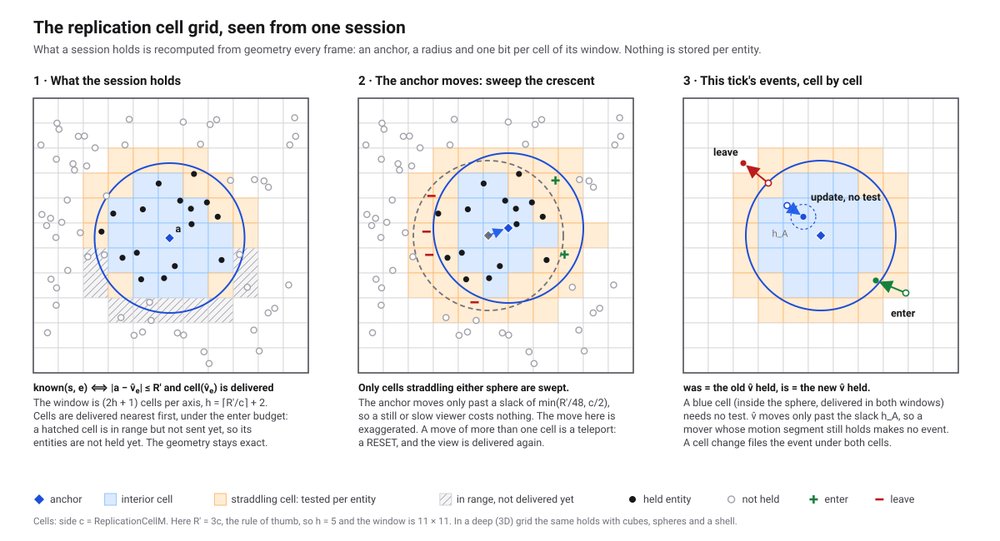
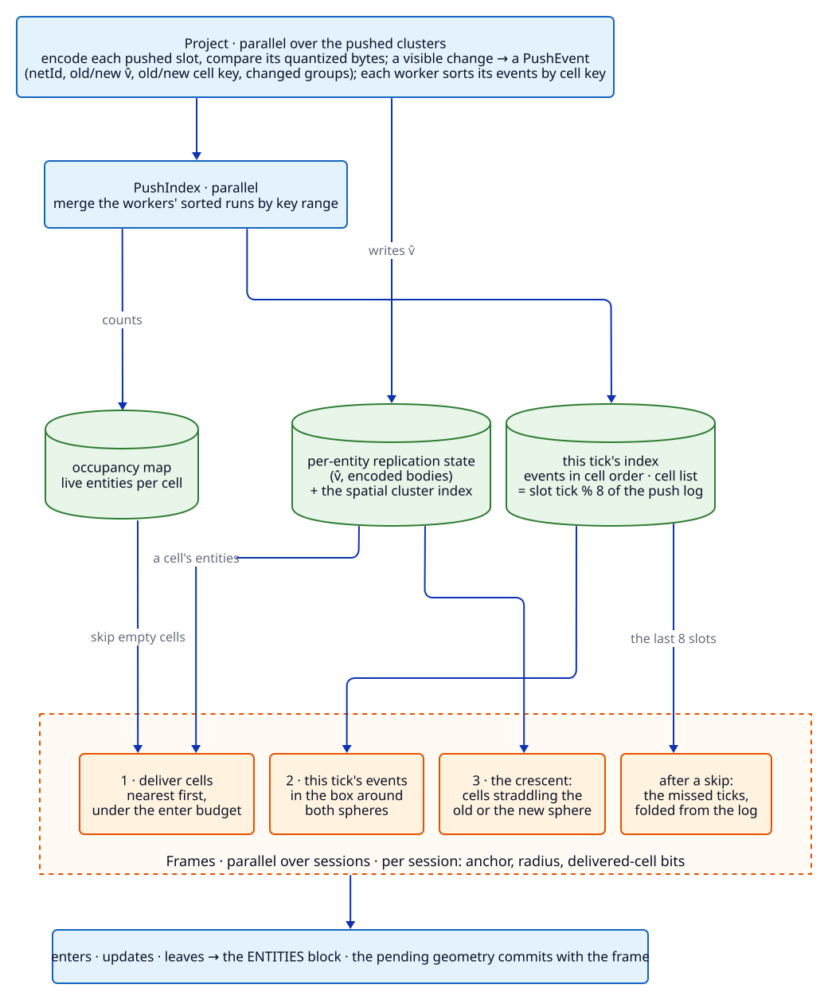

# 15 — Subscriptions

**Code:** [`src/Typhon.Engine/Subscriptions/`](https://github.com/Log2n-io/Typhon/tree/main/src/Typhon.Engine/Subscriptions) (+ the wire and codecs in
[`src/Typhon.Protocol/`](https://github.com/Log2n-io/Typhon/tree/main/src/Typhon.Protocol), the WebSocket adapter in
[`src/Typhon.Subscriptions.AspNetCore/`](https://github.com/Log2n-io/Typhon/tree/main/src/Typhon.Subscriptions.AspNetCore), the clients in
[`src/Typhon.Client/`](https://github.com/Log2n-io/Typhon/tree/main/src/Typhon.Client) and
[`src/Typhon.Client.TypeScript/`](https://github.com/Log2n-io/Typhon/tree/main/src/Typhon.Client.TypeScript), the attribute generator in
[`src/Typhon.Generators/ReplicationGenerator.cs`](https://github.com/Log2n-io/Typhon/blob/main/src/Typhon.Generators/ReplicationGenerator.cs))

Subscriptions replicate engine state to remote clients — game clients, browsers, bots — and drain their typed commands back into the tick.
The application declares **projections** (what of each archetype travels), **profiles** (who sees what), session kinds and admission,
commands and events; it tells the engine what it changed with `Replicate`. The engine does the rest on the worker pool: change detection by
comparison of quantized bytes, encode-once, per-session visibility from geometry, frames, send pumps, backpressure and inbound hardening.

Two decisions shape everything below:

- **Replication is pushed and explicit** (ADR-067). An entity is looked at only when it was pushed — by the application after a write, or by the engine for
  structure and spatial changes. Per-tick work follows what changed, never the archetype.
- **What a session holds is geometry.** Nothing is stored per (session, entity). A session's view is recomputed from its anchor, the cells
  delivered to it, and each entity's last visible position. A session costs a few hundred bytes plus its frames, whatever it holds.
  [§3](#3-the-cell-algorithm-who-receives-what) explains the algorithm and why it scales.

This chapter is the mechanism. For usage see [Guide ch.7](../guide/07-subscriptions.md); for per-feature guarantees, the
[feature catalog](../feature-set/Subscriptions/README.md).

---

## 1. Where it runs in the tick

```text
Engine-Pre track     SubscriptionsIngress   drain every session's inbound ring → typed command buffers; apply
                                            opened/closed sessions and the requests systems staged last tick (profile,
                                            control, budget, kick)
Public track(s)      application systems    read ctx.Subscriptions.Commands<T>(); write components; Replicate(…);
                                            Emit(…)
Tick fence           (unchanged)            its per-cluster structure words record spawns, destroys, WriteSpatial moves
                                            and Replicate marks; its migration step carries each moving entity's
                                            replication entry
Engine-Subscriptions track (inside the fence's exclusive window):
                     Project                serial: collect the push set, give each pushed cluster a block · parallel:
                                            compare, encode, emit PushEvents
                     Events                 resolve and encode this tick's emitted events once
                     PushIndex              sort each worker's events by cell key, merge into the tick's slot of the
                                            push log
                     PushFar                distance-LOD far flushes, by key range
                     Frames                 serial: skip policy, profile/session prologue · parallel over sessions:
                                            gather, sort, encode, hand off
UoW flush            (unchanged)            the tick's writes made durable
Publish                                     Volatile.Write(CommittedTick, T): send pumps may now send this tick's frames
```

- **Compute after the fence, publish after the flush** (SUB-02). The track reads component data only inside the fence's exclusive window,
  where no application writer runs — the quiescence SingleVersion data needs, since it keeps no snapshot. Frames are released only after
  the durability flush, so a client never sees state a crash could take back. An aborted or fence-failed tick dispatches no stage, and no
  session's geometry moves. A flush that fails after frames were produced closes every session.
- **Stages, not a chain of dispatches.** Serial work runs in the next stage's single-threaded `Prepare` hook, so each dispatch barrier is
  paid once per stage. Below `SubscriptionsOptions.CollapseBelowWorkUnits` one collapsed system runs the same bodies inline and produces
  the same bytes.
- **Epochs, no fence enrolment.** Each chunk enters its own `EpochGuard`; replication writes only its own native memory, never a
  fence-owned structure.

## 2. The push set and projection

**The push set** is the per-cluster 64-bit structure word the fence already keeps. `ctx.Subscriptions.Replicate(in cluster, slot)` — and
`Replicate(in EntityRef)` for an entity opened by id — is one atomic OR into it. The engine adds its own pushes: spawns and destroys,
`WriteSpatial` moves (a mutable span over the spatial column marks its whole cluster), migration arrivals, slots still extrapolating (a mover
that stopped without a write must still be told to stop), slots denied an identity last tick, and — on the first tick, or a tick the fence
could not describe — every live entity.

**Projection** (`ProjectionPass`, compiled by `ProjectionCompiler` into a `CompiledProjectionPlan` per archetype):

1. **The blocks step** (serial): drop last tick's marks, collect this tick's `(chunk, mask)` pairs per archetype, drain the entries the fence
   parked, and give every pushed cluster a **replication block** (`ReplicationBlockPool`, keyed by cluster chunk id in a
   `ReplicationDirectory`).
2. **Per pushed slot** (parallel, blocks claimed four at a time): walk the plan column by column (`ProjectionColumnWalk`) — read the field
   at its cluster-layout offset (SUB-01), quantize, encode each change group into scratch, **compare byte for byte** with the stored copy.
   The comparison *is* the encode (SUB-10): a spurious push costs an encode, never a byte on the wire.
3. A new or reused slot gets an identity; an emptied slot releases its identity; movers run through `MotionTracker`.
4. Every slot whose visible state changed emits a **`PushEvent`** into its worker's list: netId, old and new *decoded* positions and cell
   keys, changed groups, segment and arrival flags.

**Per-entity state** — one entry per live entity of an observed archetype, shared by every session, in native blocks beside the clusters
(`ArchetypeReplicationState`, `ReplicationBlockLayout`):

| Part | Holds | Size (2D mover, short state) |
|---|---|---|
| Hot entry | `EntityId`, netId, generation, flags; one change tick per group + the segment tick; the encoded segment (`p0`, `v`, `t0`, epoch); the packed group bodies | 64 B |
| Cold entry | previous position, the visibility position v̂, the run start of the current segment, the tick of the last event (SUB-19) | 32 B |

Strides are sized per archetype by the plan and rounded to cache lines. Entries move with their entity through migration and repair and
never survive slot reuse (SUB-09).

**Motion segments.** A mover's position travels as `(p0, v, t0)`; the client extrapolates. A new segment is emitted when
`|p0 + v·(T − t0) − p_T|` exceeds the tolerance, on a teleport (a step faster than the declared speed → the epoch advances), or on a
heartbeat for moving segments. `v` is refit from where the current straight run began, quantized to 1/16 position quantum per tick, so
float jitter never produces segments; a run restarts when the step departs from its mean velocity. Velocities are displacements per tick,
so a changing tick period (overload time dilation) never distorts motion; the velocity codec's width is derived from `Teleport` and the
largest tick multiplier.

**The visibility position v̂** is updated here, per pushed mover: it is what every geometric test reads ([§3.1](#31-terms)).

**Identities.** One global netId space (`NetIdAllocator`, per-worker leases), because an entity reference in an event or a command is a bare
netId. A released netId is **quarantined** for longer than a session may go without a frame, so no frame can carry an identity's leave and
its reuse's enter (SUB-06). `NetIdEntityIndex` maps netIds back to entities for `TryResolve`.

## 3. The cell algorithm: who receives what

Every tick, replication answers one question per session: which entities entered its view, which changed, which left. Answered naively,
that is sessions × entities distance tests, or per-(session, entity) state that remembers what each client holds and at what version.

Typhon's first pipeline kept that state. The measurement that retired it:
- It kept a per-session known-set and view, ≈ 23 B per held entity and 544 B per cluster.
- Probing the known-set is a DRAM miss: 1 000 sessions' tables fit no cache, ≈ 150 ns per record sent.
- At 269 k entities and 1 000 sessions, interest management cost ≈ 121 µs of CPU per session, **≈ 50× the geometry itself**. The pipeline
  was bound by its state, not by its geometry.

The cell algorithm keeps **no per-(session, entity) state**. What a session holds is a function of geometry, recomputed each frame from a
few numbers per session and one shared, per-tick index of what changed, bucketed by cell.

### 3.1 Terms

| Term | What it is |
|---|---|
| **Replication cell**, side *c* | A cube of side `SubscriptionsOptions.ReplicationCellM` over the spatial world's bounds (one cell deep when the spatial grid is flat). The unit of indexing, delivery, sweeping and logging. Required and never derived: every per-session cost scales with R′/*c*. Rule of thumb: *c* ≈ R′/3 of the profile with the most sessions |
| **Cell key** | The cell's coordinates packed 21 bits per axis, `(cz << 42) \| (cy << 21) \| cx`: shifts to decode, a row is `key >> 21`, and it sorts like a row-major index. A flat grid sorts by row; a deep one by **tile** (4³ cells), so a 3D lookup probes a tile rather than a row |
| **Visibility position** v̂ₑ | The only position any geometric test reads for entity *e* (SUB-20). Reset at spawn, on a teleport, and when the entity drifts more than `h_A` from it. `h_A` = the smallest `R/48` (or half-band) over the Sphere profiles observing the archetype, capped at *c*/2. Stored in the entity's cold entry: 6 B in 2D, 9 B in 3D |
| **Push event** | What the projection emits when an entity's visible state changed: netId, old and new v̂, old and new cell keys, changed groups, the segment flag. 48 B flat, 64 B deep (one cache line). Filed as a **primary** under its new cell and, if it changed cell, a leave-only **secondary** under the old one |
| **Push index** | This tick's events sorted by cell key: the events (each cell's primaries, then its secondaries), a cell list `(key, start, primaryEnd)`, and a table from probe unit (row or tile) to its first cell |
| **Push log** | The last 8 ticks' indexes, slot `tick % 8`, shared by every session |
| **Occupancy map** | Live entities per cell by `cell(v̂)`, kept from the events |
| **Anchor** *aₛ* | The centre of session *s*'s sphere. It follows the viewpoint only when that drifts more than `min(R′/48, c/2)`; a drift of more than one cell is a teleport |
| **Radius** R′ | The profile's radius; the midpoint of its enter/leave band when it declares one; or the session's `SetRadius` value |
| **Window** | `(2h + 1)` cells per axis around the anchor's cell, `h = ⌈R′max / c⌉ + 2`, with one bit per cell: **delivered** or not. Committed and pending copies |
| **Interior / straddling cell** | A cell wholly inside a sphere / crossing its surface |
| **Crescent** (a **shell** in 3D) | The cells straddling the old or the new sphere after the anchor moves or the radius changes |

### 3.2 The invariant

For session *s* and entity *e*:

```text
known(s, e)  ⟺  |aₛ − v̂ₑ| ≤ R′   ∧   delivered(s, cell(v̂ₑ))
```

Nothing stores `known`. It is kept true by construction: every change to one of its terms emits exactly the enters and leaves that move the
client from the old value to the new one (SUB-16).

| Change | What is tested | Emits |
|---|---|---|
| The entity's v̂ moves (a push event) | its old and new v̂, against the old and new sphere and window | update, enter or leave |
| Spawn / destroy | an event from / to nowhere | enter / leave |
| The anchor moves, or R′ changes | the entities in the crescent's cells | enter / leave |
| A cell is delivered | the cell's entities inside the sphere | enter |

- **Exact, in integers.** v̂ and the anchor are the quantized values the wire carries, decoded identically by every path, so the push step,
  delivery, the sweep, the log's replay and the test oracle agree bit for bit.
- **One writer per identity per frame.** An entity with an event since the session's last frame belongs to the event step (or to the log's
  replay after a skip); every other entity belongs to delivery or to the sweep. The steps partition the entities, so a frame names each
  identity once, with no dedupe set.
- **What v̂'s slack costs.** An entity is held while its true position is within `R′ − h_A`, and dropped past `R′ + h_A`: at R = 192 m,
  `h_A` = 4 m, ±2 % of the radius. The anchor's slack makes the same trade on the viewer's side. A declared band `Sphere(R, leave: L)` is
  served through the same slack: an entity within R is held, one beyond L is not, and an entity oscillating by less than `h_A` never flaps.

<a href="assets/subscriptions-cell-geometry.svg">
  
</a>
<sub>Generated by <code>in-depth-overview/assets/subscriptions-cell-geometry.py</code>; the cell classes are computed, not drawn.</sub>

### 3.3 What is stored

| Where | What | Size |
|---|---|---|
| Shared, per tick | the push index: events, cell list, unit table | 48 / 64 B per event, 16 B per occupied cell and per row |
| Shared | the push log: the last 8 indexes | 8 slots, reused |
| Shared | the occupancy map | one count per occupied cell |
| Per entity | v̂, in the cold entry beside the encoded state | 6 B (2D), 9 B (3D); none when `h_A = 0` |
| Per session | anchor, window origin, radius, level, cursor; pending copies | a few hundred bytes |
| Per session | the window's delivered bits, committed + pending | 64 B inline (flat); ≤ 676 B in a native slab (deep, 13³) |

Nothing per session grows with what it holds. A session that sees 20 000 entities costs the same memory as one that sees none.
`Start` refuses a Sphere window wider than **15 cells per axis in a flat grid, 13 in a deep one** (`⌈R′/c⌉` ≤ 5 or ≤ 4) and names the
cell side that would fit: the window is what one session's gather pays, so it is bounded up front.

### 3.4 Each tick: the shared index

<a href="assets/subscriptions-cell-pipeline.svg">
  
</a>
<sub>D2 source: <code>in-depth-overview/assets/subscriptions-cell-pipeline.d2</code></sub>

1. **Project**, at the end of each chunk while its events are still in cache: each worker computes every event's sort key
   (`key · 2 + isSecondary`, so a cell's primaries precede its secondaries) and radix-sorts its run over the key's used bits only.
2. **PushIndex**: a serial prologue picks key-range splitters and slices every run; the parallel chunks each merge their slices (a loser
   tree), write the events in key order into the tick's log slot, and emit the cell list and the probe-unit table. The chunk that owns a key
   range also applies that range's occupancy changes, so each count has one writer.
3. That slot **is** the push log's entry for this tick: nothing is copied to keep history.

Cost: `O(events)` plus a fixed prologue. An empty world of any extent costs the prologue; the grid is never walked.

### 3.5 Each session: the gather

`Frames` runs this per session, in parallel, with no contention: session state has one writer, and everything shared is read-only by now.

1. **The anchor.** If the viewpoint drifted past the slack, the anchor moves to it; past one cell, it is a teleport: a `RESET` and an empty
   window. Otherwise the anchor stays, and a still or slow viewer does no sweep at all. The window follows the anchor's cell: every row
   shifts, by at most one cell per axis. The window's two-cell margin is what makes a one-cell move safe.
2. **Delivery**, nearest first. Rings of Chebyshev distance around the anchor's cell; each undelivered cell the sphere reaches is delivered
   until the enter budget is spent. A cell whose occupancy is zero costs one probe. Otherwise the cell's box, padded by `h_A` + 1 m, is
   queried on the spatial cluster index, clusters that cannot intersect are pruned, and every entity without an event whose v̂ lies in
   the cell and the sphere is entered. When the budget did not bind, the whole view is held and `VIEW_COMPLETE` is sent.
3. **This tick's events.** Only the occupied cells of the box around both spheres are visited: one probe of the unit table per row (or
   tile), then a scan of that unit's cells. In an **interior** cell (inside both spheres, delivered in both windows), an event that stayed
   in the cell is an update with no test. Elsewhere, per event: `was` = the old v̂ in the old sphere and its cell delivered in the old
   window; `is` = the same with the new ones; → update, enter or leave. A secondary is skipped when its primary cell is in the box, since
   it is handled there.
4. **The crescent**, only when the anchor moved or the radius changed. Delivered cells that straddle either sphere are swept: each entity
   without an event is tested against both spheres → enter or leave. Cells inside both spheres or outside both are not touched.
5. **Distance LOD.** Far entities' updates wait for their phase tick and are flushed from the log ([§4](#4-frames)).

After a skip, the missed ticks are folded from the log into one union before step 3 (SUB-03). Past the log, or when the log cannot say,
the session is reset. The anchor, window and radius computed here are **pending**: they commit only when the frame is published, so a frame
dropped before it is sent leaves the committed geometry describing exactly what the client has.

The other observers use the same machinery. A **`World`** session holds every cell before a cursor, walked in dense order over the
occupancy map's occupied cells only. A **`ClientRegion`** session replaces the sphere with the convex hull the client sent (half-spaces:
2*k* dot products classify a cell as inside, outside or straddling).

### 3.6 Why it scales

| Work | Grows with | Does not grow with |
|---|---|---|
| The index ([§3.4](#34-each-tick-the-shared-index)) | this tick's events | world size, entity count, session count |
| A session's event step | occupied probe units in its box, events in its range | world size, entities it holds |
| A session's delivery | cells delivered this frame, bounded by the enter budget | entities already held |
| A session's sweep | only anchor moves: straddling cells' entities | a still viewer: zero |
| A session's memory | nothing: a window of bits | entities it holds |

- **No per-(session, entity) state, so nothing to miss in DRAM.** Sessions read the same shared index, and sessions in the same area read
  the same cache lines. In the micro-benchmark that chose this design, the geometric known-set cost **13.7 µs per session against 110.6 µs**
  for a hash known-set, with **0 bytes against 236 KiB** of state per session (d06, 1 000 sessions, 10 % of entities changing per tick).
- **Work follows change, twice damped.** Motion segments send a mover's path, not its positions; v̂ turns its position into an event only
  every `h_A` of travel. A mover whose segment still holds makes no event, and no session looks at it.
- **Encode once.** The projection encodes each changed entity once; a frame copies bytes. Two sessions in the same state receive the same
  bytes.
- **Parallel by construction.** The index is built per worker and merged by key range; sessions are gathered independently, each by one
  worker.

**Measured**, on the SWG Tatooine demo (269 k entities, 50 Hz, Ryzen 9 7950X, bots on the same machine):
- 1 000 player sessions: the replication track took **1.95 ms** a tick, against **9.17 ms** for the per-session pipeline it replaced
  (paired A/B, 6/6 pairs, same wire bytes within 5 %); ≈ 1.5 ms after later work ([§10](#10-cost)).
- 5 000 player sessions: track p99 **3.25 ms** (one run, simulation at 10 Hz).
- The index build is ≈ 0.1 ms. The rest is Project and Frames, which grow with changes and sessions, never with the world.

What binds next is the network link, not the CPU, and the levers there are payload levers: segments, distance bands, radii and cadence.

## 4. Frames

`Frames`' prologue runs the skip policy ([§6](#6-hand-off-send-pumps-and-backpressure)) and the per-profile work; its chunks claim sessions one at a time (`FrameAssembler`). For each
session:

1. **The gather** ([§3.5](#35-each-session-the-gather)): missed ticks folded from the log, then the anchor and window, delivery, this tick's events and the crescent,
   giving enter, update and leave lists per archetype.
2. **Distance bands** (`LodBands`): an update to an entity far from the session before and after waits for the entity's phase tick and is
   flushed from the log; enters and leaves never wait.
3. **Records sorted by netId, encoded once per archetype** into an `ENTITIES` block (`EntitiesEncoder`): an enter copies the entity's encoded
   enter record, an update the group bodies the projection encoded. Then `SELF`, `ACKS`, `EVENTS`, `AGG`, `STATS`, `DEBUG`.

Each identity is reached once per frame without a dedupe set ([§3.2](#32-the-invariant)). Frames are encoded into a per-worker scratch, then copied into a pooled native block of the right size class
(`FramePool`: 512 B, 2, 8, 32, 128, 256 KiB). Two sessions in the same state receive identical bytes.

## 5. Owner state and acknowledgements

- **Owner groups** are a separate section of the projection. `SelfTracker` keeps, per session slot, a **pending mask** of owner groups
  changed since its last frame — OR-ed by the projection chunks with `Interlocked.Or` through a reverse map from controlled entity to
  sessions, rebuilt when `Control` changes. The frame's `SELF` block carries the controlled entity's netId, the pending groups and
  `lastSeq`. A control change, a reset or the first `SELF` sends every group (SUB-11); no controlled entity is netId 0, sent once.
- **Acknowledgements.** Commands refused on the transport thread and by `Reject` are recorded in a per-tick `CommandAckLog`, sorted by
  session into `AckHistory` — a ring of `LogDepth` ticks — and delivered in the session's next frame's `ACKS` block; a session that skipped
  collects the rejections of every tick it missed while the history holds them, and counts what fell out of it.

## 6. Hand-off, send pumps and backpressure

The tick never awaits a send. **Send pumps** (`SendPump`, thread-pool tasks) walk per-worker ready lists of the sessions that produced a
frame this tick, and hand frames to each session's link — at most one send in flight per session, a completion chaining the next.

| Counter | Written by | Read by | Ordering |
|---|---|---|---|
| `ReadySeq` | the Frames chunk, after writing the frame into `slot[seq % 2]` | the pump | release → acquire: bytes before sequence |
| `CommittedTick` | the tick driver, after the flush | the pump: sendable iff `frame.Tick ≤ CommittedTick` | release → acquire: the durability gate |
| `SentSeq` | the pump, once the link released the bytes | the Frames chunk, before reusing a slot | release → acquire |

Every cross-thread publication is a named release/acquire pair, correct on arm64 (SUB-04); session state has one writer, the tick side
(SUB-05).

- **Skip, never queue.** `K = 2` frames per session. A session whose slots are both busy is skipped: nothing is gathered, nothing moves; its
  next frame carries the union, from the log (SUB-03). A skip run degrades the session to every 2nd, then every 4th tick, then closes it with
  1013 at `CloseStalledAfter`. An idle tick is not a skip (SUB-15).
- **Acknowledgement-based lag.** A completed send proves nothing about delivery (kernel buffers, proxies). Clients report `lastAppliedTick`
  in a mandatory 4 Hz `PING`; a session too far behind is skipped; one that stops pinging is closed with 4001.
- **Budgets and detail levels.** A per-session byte budget moves a per-session LOD level (0–3): longer band periods, a smaller enter budget,
  finally a smaller radius — never dropped state. Under overload every Sphere session is a level up and every profile served half as often.
- **Closing.** A session the tick closes is told why — a `KICK` sent by its pump after whatever it was writing — before its link closes
  (SUB-14); rows and frames are freed when nothing is in flight.

## 7. Sessions and ingress

**Transports** implement `ISubscriptionTransport` and hand each connection to the engine's `ISubscriptionAcceptor`; a
`SubscriptionConnection` per link runs the handshake and, once open, the inbound path. The built-in `TcpSubscriptionTransport` and the
ASP.NET Core adapter differ only in framing.

- **Handshake.** `HELLO` (≤ 16 KiB, within 5 s) → declared kind → the application's admission hook → a row in the **`SessionTable`**
  (native, `MaxSessions` rows, generation-stamped `SessionId`s) → `WELCOME` with the catalog unless the client presented its hash.
- **Staged requests.** `Session(id).Profile/Control/SetBudget/Kick` append to per-worker segments of a `SessionRequestLog`, applied
  single-threaded by the next tick's ingress prologue — which is what lets any system on any worker make them.
- **Inbound path**, on the transport thread, per message: the message cap (1009); the session's **inbound byte budget** — a token bucket kept
  in bytes × clock ticks, one second deep; a `COMMANDS` message over it is refused whole, each command acknowledged; every other message is
  charged, never refused; then `CommandsMessage.Read` validates the whole message before a single command is framed (a malformed tail
  delivers nothing, 1007); per command the role, the type's token bucket and the stateless pre-check; what passes is framed into the
  session's **`IngressRing`** — an SPSC ring (4 KiB by default) carved from a native slab pool (`IngressRingPool`). A full ring drops and
  counts; the transport thread never blocks.
- **Abuse.** Refused commands (budget, rate, role) are counted per window; past `AbuseRefusalsPerWindow` for `AbuseWindows` adjacent windows
  the session is closed with 1008 (SUB-27). Every refused command is acknowledged; a session places at most 8 transport-side refusals per
  tick in the shared acknowledgement log, which is sized for that share, so no session can crowd out another's.
- **Drain.** `SubscriptionsIngress` (Engine-Pre) drains every ring into `CommandTypeBuffers`: per command type, per-worker segments of
  headers and payloads plus a per-session index stamped by tick (no per-tick clear), which is what makes `TryGetLatest` O(1) and a command
  visible for exactly one tick (SUB-08). Coalescing types keep only the newest per session.
- **`TryResolve`** answers only for entities the session holds in its *committed* geometry — the view its client was last sent — or controls,
  and only while the netId is still bound to a live entity (SUB-26).

## 8. Events

`EventHub`: systems emit into per-worker buffers; after the projection the Events stage resolves each event's `EntityId` fields to netIds
(including entities destroyed this tick) and encodes it **once** through the catalog's field plans. Routing is per event: `Near` and
`ToKnown` file one entry per point by cell and let each session search only its cell box against its own geometry; `ToOwner` and
`ToSession` are sorted lists each session binary-searches; `Broadcast` is everyone. A log of `LogDepth` ticks serves skipped sessions; past
it, a 256-tick summary counts what a session missed, delivered as the built-in `EventsLost`.

## 9. The catalog and the wire

At `Start`, `CatalogBuilder` compiles the plans, profiles' grids, commands, events and metrics into the **catalog** — canonical JSON, every
collection sorted, indices assigned in canonical order, built-ins at reserved indices — and hashes it. It travels in `WELCOME` and is served
by `MapTyphonCatalog`. The wire (`typhon.3`, [`Typhon.Protocol`](https://github.com/Log2n-io/Typhon/tree/main/src/Typhon.Protocol)):
messages `HELLO`, `WELCOME`, `TICK`, `COMMANDS`, `PING`/`PONG`, `KICK`, `BYE`; a `TICK` carries typed, length-prefixed blocks — `ENTITIES`,
`EVENTS`, `SELF`, `AGG`, `STATS`, `DEBUG`, `ACKS`, `EXT` — each skippable by a client that does not know it. Records are absolute: a frame
never depends on one the client might have missed. Codec arithmetic (quantization, packing, varints, half floats, positions, velocities) is
specified bit-exactly and pinned by golden vectors shared by the engine, `Typhon.Client` and the TypeScript SDK.

**Attributes** (`[Replicated]`, `[ReplicatedMessage]`…, in `Typhon.Protocol`) are compiled by `ReplicationGenerator` into generated
implementations of `IReplicatedArchetype` (the builder calls) and `IReplicatedMessage` (an engine-free field descriptor) — no reflection.

## 10. Cost

Measured on the SWG Tatooine demo — 269 k entities, 1 000 player sessions (Sphere 192 m), 50 Hz, Release, Ryzen 9 7950X, bots on the same
machine: the whole replication track ≈ **1.5–1.6 ms** per tick (≈ 20 % of the tick), wire ≈ 100 KB/s per session. Project and Frames are
the two large stages, ≈ 0.7–0.8 ms each; the push index ≈ 0.1 ms. Why it costs so little, and what it grows with: [§3.6](#36-why-it-scales).

## 11. Rules

The invariants live in [`rules/subscriptions.md`](https://github.com/Log2n-io/Typhon/blob/main/rules/subscriptions.md), each with the tests
that verify it: SUB-01 (reads through the cluster layout), SUB-02 (compute after the fence, publish after the flush), SUB-03 (records
absolute, skips are unions), SUB-04 (release/acquire hand-offs), SUB-05 (one writer per session row), SUB-06 (netId reuse), SUB-07 (no
steady-state allocation), SUB-08 (commands visible for exactly their tick), SUB-09 (state follows migration), SUB-10 (the push set, compared
quantized), SUB-11 (owner groups after control changes), SUB-13 (cost follows the push set), SUB-14 (told before closed), SUB-15 (skips count
back-pressure only), SUB-16 (held = geometry), SUB-19 (the event stamp), SUB-26 (`TryResolve`), SUB-27 (refusals answered, abuse closed),
and the Phase 2 rules on v̂, windows, counts and events.

## See also

- [06-ecs](06-ecs.md) — clusters and the structure words the push set rides on
- [07-spatial](07-spatial.md) — the spatial grid delivery and sweeps query
- [10-runtime](10-runtime.md) — tracks, the fence, overload
- [11-durability](11-durability.md) — the flush that gates publication
