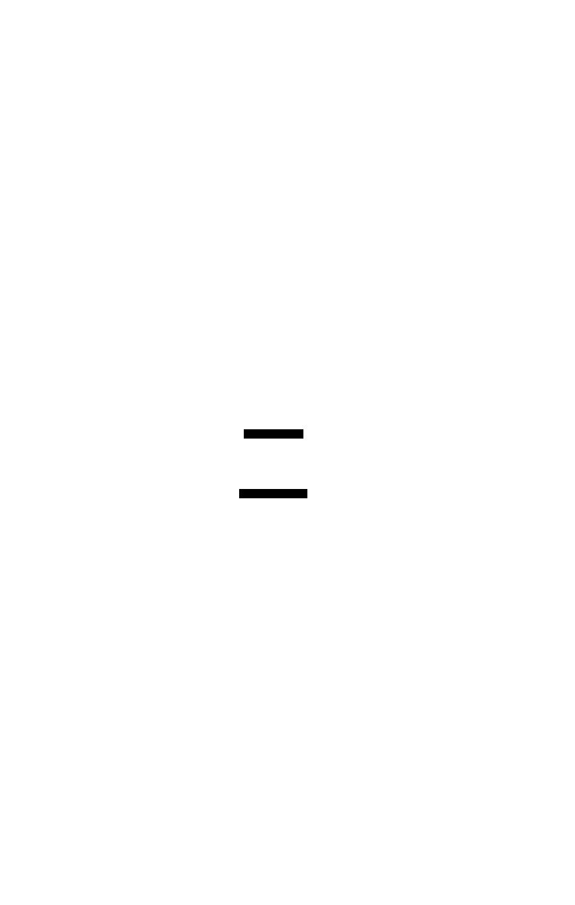

# Spatial index

> **In one line:** mark a 2D or 3D box field (`AABB2F` / `AABB3F`) `[SpatialIndex]` and Typhon answers **geometric** queries — nearby, in-box, along-a-ray — from a spatial structure instead of a scan.

A spatial index indexes an **axis-aligned box** — 2D (`AABB2F`) or 3D (`AABB3F`) — not a point, so a point entity carries a small `Bounds` component whose box collapses onto its position. The broadphase runs natively in 3D; a 2D field is simply queried with an infinite Z range, so 2D and 3D archetypes coexist through one code path. You size the coarse grid once (`ConfigureSpatialGrid` in the engine options — see *Structure* below), then query by geometry: `WhereNearby` / `WhereInAABB` / `WhereRay` (all take `x, y, z, …`).

> 📌 **Precision:** the double-precision boxes (`AABB2D` / `AABB3D`) are defined as types but not yet wired for spatial indexing (deferred, follow-up of [#228](https://github.com/Log2n-io/Typhon/issues/228)) — index with the `f32` variants (`AABB2F` / `AABB3F`).

The index is maintained at the **[tick fence](xref:concept-tick-fence)** — automatically each tick under the runtime, or via `dbe.WriteTickFence(n)` from a bare transaction. Mutate a `[SpatialIndex]` field through the `WriteSpatial` barrier so the refresh isn't skipped (the analyzer flags a plain write with `TYPHON009`).

## Structure: sparse grid, per-cell static & dynamic R-trees

`ConfigureSpatialGrid` sizes a **coarse cell grid** (world bounds + cell size) — the first acceleration level, and *not* the index itself. The grid is **sparse**: a per-cell index is **lazily allocated only for cells that actually hold clusters**, so empty space costs nothing.

Each populated cell holds **two** R-trees, split by the field's `SpatialMode`:

- **`DynamicIndex`** — moving entities (the default). Refreshed at the [tick fence](xref:concept-tick-fence), with a fat-AABB margin so small moves rarely force a re-insert.
- **`StaticIndex`** — fixed entities, declared `[SpatialIndex(Mode = SpatialMode.Static)]`. Built once, **skips the fence**, and is touched only on create/destroy.

A query visits a cell's dynamic tree, then its static tree, then advances to the next cell.

Coarse grid → sparse occupied cells → per-cell static + dynamic R-trees. Source: `key-concepts/assets/spatial-grid.d2`.

## How it relates

- **[Component](xref:concept-component)** — declared on an `AABB2F` component field.
- **[Query](xref:concept-query)** — spatial predicates compose with field/`Where` filters (intersection).
- **[Tick fence](xref:concept-tick-fence)** — where the spatial index is refreshed.
- **[Index](xref:concept-index)** — the value-lookup sibling.

## In the API

- `[SpatialIndex(margin)]` — with `Mode = SpatialMode.Static` for fixed entities — on a float AABB field (`AABB2F` 2D / `AABB3F` 3D), plus `WhereNearby` / `WhereInAABB` / `WhereRay` on [`EcsQuery<T>`](xref:concept-query) (spatial attributes and geometry types aren't in the API reference).

## Learn & use

- **Narrative:** [Guide ch.2 §4 — spatial queries](xref:guide-modeling)
- **Feature detail:** [spatial](xref:feature-spatial-index) · [spatial query API](xref:feature-spatial-spatial-query-api) · [spatial grid config](xref:feature-spatial-spatial-grid-config)
